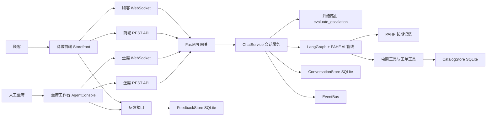
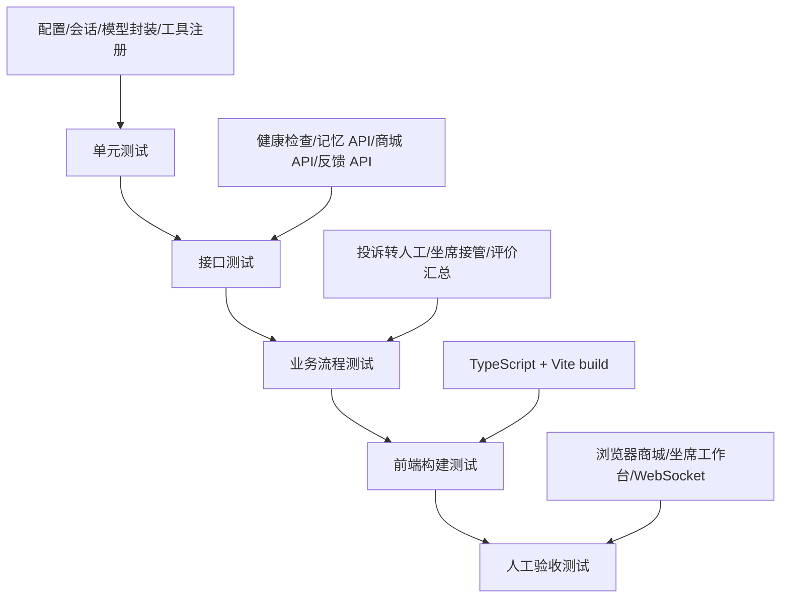
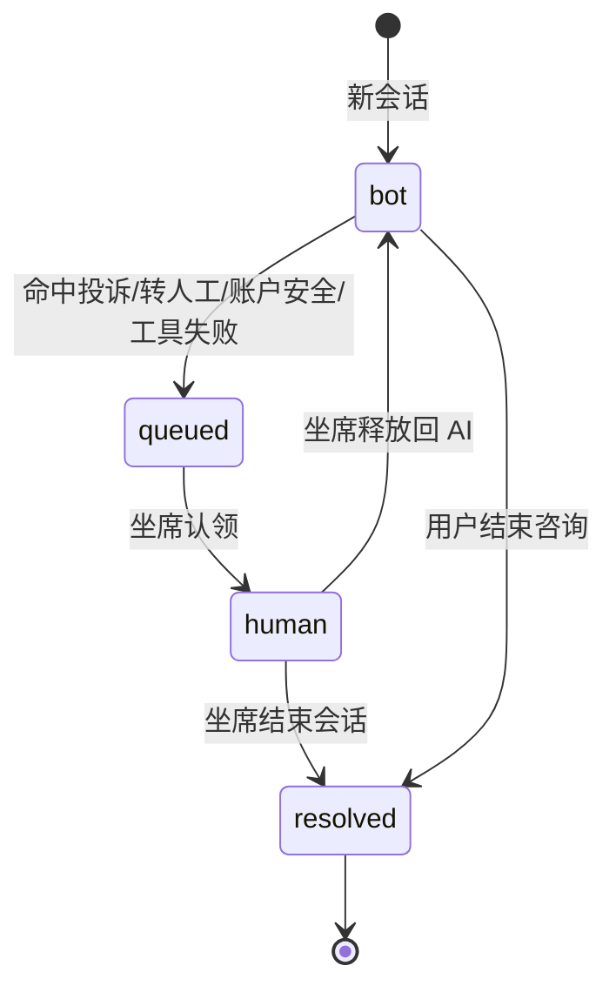
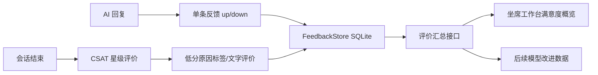

# 07-电商售后客服与用户评价分析系统-测试文档

> 项目组：25组-电商售后客服与用户评价分析系统
> 被测仓库：shopping-agent-with-PAHF-memory-system-by-Langgraph
> 文档用途：作为系统测试设计、验收测试和答辩演示测试依据
> 编写依据：仓库 README、`docs/ECOMMERCE_REALTIME_HITL.md`、后端接口代码、前端页面代码与现有 pytest 用例

## 1. 测试目标

本测试文档用于验证“电商售后客服与用户评价分析系统”是否满足以下目标：

1. 用户可以在商城界面浏览商品、搜索商品、查看商品详情与库存规格。
2. 用户可以通过客服入口咨询商品、订单、物流、优惠券、退货退款等售后问题。
3. 系统可以识别投诉、转人工、账户/资金安全、重复不满等高风险场景，并转入人工队列。
4. 坐席可以查看排队会话、认领会话、发送人工回复、释放回 AI、结束会话。
5. 系统可以收集用户对单条 AI 回复的点赞/点踩反馈，以及会话结束后的 CSAT 星级评价。
6. 后台可以聚合用户评价数据，输出满意度、星级分布、点赞率和低分原因标签。
7. PAHF 长期记忆、工具调用、会话持久化、OpenAI 兼容接口等基础能力可以稳定运行。

## 2. 被测系统概述

系统由前端、后端、AI 编排、PAHF 记忆、电商工具、实时会话、坐席工作台和反馈分析模块组成。


图 1 仓库已有系统整体流程图。



图 2 测试范围内的核心模块关系。

## 3. 测试范围

### 3.1 本次纳入测试的功能

| 模块 | 测试内容 |
| --- | --- |
| 系统启动 | 后端启动、健康检查、模型列表、配置读取 |
| 商城浏览 | 分类列表、商品搜索、商品详情、SKU 库存 |
| 售后客服 | 用户咨询、投诉/转人工识别、会话状态流转 |
| 人机协同 | 排队列表、坐席认领、人工回复、释放、结束会话 |
| 用户评价 | 单条回复点赞/点踩、会话 CSAT、低分标签、评价汇总 |
| PAHF 记忆 | 记忆新增、查询、更新、搜索、相似记忆查找 |
| 工具系统 | FAQ 检索、工单创建/查询、电商工具注册与规划 |
| 前端构建 | TypeScript 编译、Vite 生产构建 |
| 自动化测试 | pytest 单元测试与轻量集成测试 |

### 3.2 本次不纳入或只做设计验证的内容

| 内容 | 原因 | 后续建议 |
| --- | --- | --- |
| 真实大模型质量评测 | 需要有效 `API_KEY`、稳定模型服务和固定评测集 | 后续使用固定 prompt 集进行人工评分 |
| 高并发压测 | 当前项目为单机 SQLite 轻量架构 | 可用 Locust/JMeter 补测 50/100/200 并发 |
| 多浏览器兼容性 | 本次以功能验证为主 | 后续补 Chrome/Edge/Safari |
| WebSocket 长连接稳定性压测 | 需要长时间运行环境 | 后续做 30 分钟以上长连与断线重连测试 |
| 权限与登录鉴权 | 仓库当前未实现独立登录鉴权 | 后续补用户/坐席/管理员权限模型 |

## 4. 测试环境

| 项目 | 配置 |
| --- | --- |
| 操作系统 | Windows |
| Python | 3.11.5 |
| Node.js | v24.11.0 |
| npm | 11.6.1 |
| 后端框架 | FastAPI 0.115.0 |
| 前端框架 | React 18 + Vite 5 |
| 数据存储 | SQLite |
| 测试框架 | pytest 8.3.3 |
| 后端默认地址 | `http://127.0.0.1:8000` |
| 前端默认地址 | `http://localhost:3000` |

## 5. 测试数据

系统启动后，`CatalogStore` 会自动灌入虚拟商城种子数据。

| 数据类型 | 示例 |
| --- | --- |
| 商品分类 | 数码3C、家居日用、服饰鞋包、美妆个护、母婴宠物、食品饮料、运动户外、图书文具等 |
| 商品 | 40+ 件真实感演示商品；核心锚点 `P1002` 声波 X 主动降噪耳机，价格 899 元 |
| SKU | `P1002-BLK` 深空灰，`P1002-WHT` 云白 |
| 顾客 | `c9001`、`u1001`、`u1002` |
| 订单 | `SO20260012`、`SO20260027`、`SO20260041`、`SO20260050`、`SO20260068`、`SO20260073`、`SO20260088` |
| 反馈标签 | 没有解决问题、答非所问、回答太慢、态度不好、重复啰嗦、信息不准确、转人工太慢 |

## 6. 测试策略

### 6.1 测试层次



图 3 测试层次设计。

### 6.2 测试类型

| 类型 | 方法 |
| --- | --- |
| 功能测试 | 按模块设计用例，验证返回状态码、字段、业务状态 |
| 接口测试 | 使用 pytest、curl、PowerShell `Invoke-RestMethod` 验证 REST API |
| 流程测试 | 串联“用户投诉 -> 排队 -> 坐席认领 -> 结束 -> 评价” |
| 构建测试 | 执行 `npm run build` 验证前端编译 |
| 回归测试 | 每次修改后执行 `python -m pytest -q` |
| 兼容性观察 | 记录 Windows GBK/UTF-8 控制台编码差异 |

## 7. 验收标准

| 验收项 | 通过标准 |
| --- | --- |
| 后端启动 | FastAPI 正常启动，`/health` 返回 `status=ok` |
| 自动化测试 | pytest 用例全部通过，无失败用例 |
| 商城浏览 | 分类、搜索、详情接口均返回有效数据 |
| 转人工 | 投诉/转人工消息触发 `queued` 状态，记录升级原因和优先级 |
| 坐席处理 | 坐席可认领会话，状态变为 `human`，可发送回复 |
| 会话结束 | 会话可变为 `resolved`，可写入 CSAT |
| 评价分析 | 反馈汇总能正确统计星级、分布、点赞/点踩 |
| 前端构建 | `npm run build` 成功生成 `dist` |
| 文档一致性 | README、接口、测试说明保持一致 |

## 8. 重点业务流程

### 8.1 售后客服转人工流程



图 4 会话状态机。

### 8.2 用户评价分析流程



图 5 用户评价数据流。

## 9. 测试用例

### 9.1 系统启动与基础接口

| 用例编号 | 用例名称 | 前置条件 | 操作步骤 | 预期结果 | 优先级 |
| --- | --- | --- | --- | --- | --- |
| TC-BASE-001 | 后端服务启动 | 已安装 `requirements.txt` | 执行 `python -m uvicorn backend.main:app --host 127.0.0.1 --port 8000` | 服务启动成功，日志出现 application startup complete | P0 |
| TC-BASE-002 | 健康检查 | 后端已启动 | GET `/health` | 返回 `status=ok`、`model_name`、`active_sessions` | P0 |
| TC-BASE-003 | 模型列表 | 后端已启动 | GET `/api/v1/models` | 返回 OpenAI 兼容格式，`object=list` | P1 |
| TC-BASE-004 | prompt 场景列表 | 后端已启动 | GET `/api/v1/prompt-scenes` | 返回 `default`、`it_helpdesk` | P2 |

### 9.2 商城浏览

| 用例编号 | 用例名称 | 操作步骤 | 预期结果 | 优先级 |
| --- | --- | --- | --- | --- |
| TC-SHOP-001 | 查询商品分类 | GET `/api/v1/shop/categories` | 返回数码3C、家居日用、服饰鞋包、美妆个护、母婴宠物、食品饮料、运动户外、图书文具等 | P0 |
| TC-SHOP-002 | 中文关键词搜索商品 | GET `/api/v1/shop/products?query=耳机&limit=3` | 返回 `P1002` 声波 X 主动降噪耳机 | P0 |
| TC-SHOP-003 | 查询商品详情 | GET `/api/v1/shop/products/P1002` | 返回商品基础信息、价格、评分、SKU 列表 | P0 |
| TC-SHOP-004 | 不存在商品 | GET `/api/v1/shop/products/UNKNOWN` | 返回 404，提示 product not found | P1 |
| TC-SHOP-005 | 按分类过滤 | GET `/api/v1/shop/products?category=数码3C` | 返回数码类商品，不混入其他分类 | P1 |

### 9.3 售后客服与人机协同

| 用例编号 | 用例名称 | 操作步骤 | 预期结果 | 优先级 |
| --- | --- | --- | --- | --- |
| TC-HITL-001 | 投诉触发人工队列 | POST `/api/v1/shop/chat`，消息包含“投诉/转人工” | 返回 `status=queued`，`escalation.reason=complaint_or_legal`，优先级 4 | P0 |
| TC-HITL-002 | 查看排队会话 | GET `/api/v1/agent/conversations?status=queued` | 返回排队会话列表，包含会话 ID、顾客 ID、优先级、升级原因 | P0 |
| TC-HITL-003 | 坐席认领会话 | POST `/api/v1/agent/conversations/{cid}/claim` | 会话状态变为 `human`，`assigned_agent` 写入坐席 ID | P0 |
| TC-HITL-004 | 坐席发送消息 | POST `/api/v1/agent/conversations/{cid}/message` | 新增 `role=agent` 的消息 | P0 |
| TC-HITL-005 | 坐席释放回 AI | POST `/api/v1/agent/conversations/{cid}/release` | 会话状态变回 `bot` | P1 |
| TC-HITL-006 | 坐席结束会话 | POST `/api/v1/agent/conversations/{cid}/resolve` | 会话状态变为 `resolved`，可写入 `csat` | P0 |
| TC-HITL-007 | 坐席统计 | GET `/api/v1/agent/stats` | 返回 queued/human/resolved 计数与在线坐席数 | P1 |
| TC-HITL-008 | 客户 360 上下文 | GET `/api/v1/agent/conversations/{cid}` | 返回 conversation、messages、orders、memories | P1 |

### 9.4 用户评价与分析

| 用例编号 | 用例名称 | 操作步骤 | 预期结果 | 优先级 |
| --- | --- | --- | --- | --- |
| TC-FB-001 | 获取低分原因标签 | GET `/api/v1/feedback/tags` | 返回 7 个建议标签 | P0 |
| TC-FB-002 | 单条 AI 回复点踩 | POST `/api/v1/feedback/message`，`value=down` | 返回 conversation_id、message_id、value | P0 |
| TC-FB-003 | 单条 AI 回复点赞 | POST `/api/v1/feedback/message`，`value=up` | 同一消息可覆盖之前的反馈值 | P1 |
| TC-FB-004 | 提交会话星级 | POST `/api/v1/feedback/rating`，`stars=4` | 写入评分，conversation 的 `csat` 同步更新 | P0 |
| TC-FB-005 | 评价汇总 | GET `/api/v1/feedback/summary` | 返回平均星级、星级分布、up/down 统计、top_tags | P0 |
| TC-FB-006 | 导出原始评分 | GET `/api/v1/feedback/ratings?limit=5` | 返回最近评分列表 | P1 |

### 9.5 PAHF 记忆

| 用例编号 | 用例名称 | 操作步骤 | 预期结果 | 优先级 |
| --- | --- | --- | --- | --- |
| TC-MEM-001 | 新增记忆 | POST `/api/v1/memory` | 返回记忆 ID、person_id、text | P0 |
| TC-MEM-002 | 查询记忆列表 | GET `/api/v1/memory?user_id=...` | 返回该用户所有记忆 | P0 |
| TC-MEM-003 | 查询单条记忆 | GET `/api/v1/memory/{id}?user_id=...` | 返回指定记忆 | P1 |
| TC-MEM-004 | 更新记忆 | PUT `/api/v1/memory/{id}` | 返回更新后的 text | P0 |
| TC-MEM-005 | 语义搜索 | POST `/api/v1/memory/search` | 返回 hits 和 score | P1 |
| TC-MEM-006 | 查找相似记忆 | POST `/api/v1/memory/find-similar` | 相似度达到阈值时返回已有记忆 | P1 |

### 9.6 工具调用与售后意图

| 用例编号 | 用例名称 | 输入示例 | 预期工具 | 优先级 |
| --- | --- | --- | --- | --- |
| TC-TOOL-001 | 商品搜索意图 | “有没有降噪耳机” | `product_search` | P0 |
| TC-TOOL-002 | 订单查询 | “查一下订单 SO20260012” | `get_order` | P0 |
| TC-TOOL-003 | 物流查询 | “SO20260012 到哪了” | `track_shipment` | P0 |
| TC-TOOL-004 | 退货申请 | “我要退货 SO20260012” | `initiate_return` | P0 |
| TC-TOOL-005 | 优惠券查询 | “有什么优惠券” | `list_coupons` | P1 |
| TC-TOOL-006 | 库存查询 | “P1002-WHT 有没有货” | `check_inventory` | P1 |

### 9.7 前端页面

| 用例编号 | 页面 | 操作步骤 | 预期结果 | 优先级 |
| --- | --- | --- | --- | --- |
| TC-FE-001 | 商城页 | 打开前端默认首页 | 展示商城搜索框、分类、商品卡片、顾客 ID | P0 |
| TC-FE-002 | 商品详情弹窗 | 点击商品卡片 | 展示商品详情、规格、库存、咨询客服按钮 | P0 |
| TC-FE-003 | 客服挂件 | 点击右下角客服按钮 | 展示聊天窗口、状态、快捷按钮 | P0 |
| TC-FE-004 | 坐席工作台 | 切换到坐席工作台 | 展示排队列表、聊天区、客户 360 | P0 |
| TC-FE-005 | 调试台 | 切换到调试台 | 展示原调试对话/记忆/trace 功能 | P1 |
| TC-FE-006 | 评价弹窗 | 会话结束后 | 弹出星级评分与低分标签 | P0 |

### 9.8 异常与边界

| 用例编号 | 场景 | 操作步骤 | 预期结果 | 优先级 |
| --- | --- | --- | --- | --- |
| TC-ERR-001 | 聊天请求缺少 message | POST `/api/v1/chat`，不传 message | 返回 422 | P0 |
| TC-ERR-002 | 记忆 ID 不存在 | GET `/api/v1/memory/999999?user_id=x` | 返回 404 | P1 |
| TC-ERR-003 | 评价星级越界 | POST `/api/v1/feedback/rating`，stars=6 | 返回 422 | P1 |
| TC-ERR-004 | 逐条反馈值非法 | POST `/api/v1/feedback/message`，value=bad | 返回 422 | P1 |
| TC-ERR-005 | 无真实 API_KEY 调用 AI 自动回复 | POST 普通聊天内容 | 可能触发模型服务错误或转人工；报告需明确标注未完整验证 | P0 |

## 10. 测试执行命令

```powershell
# 安装后端依赖
python -m pip install -r requirements.txt

# 运行自动化测试
python -m pytest -q

# 启动后端
$env:API_KEY='<your-api-key>'
$env:LOG_FORMAT='text'
python -m uvicorn backend.main:app --host 127.0.0.1 --port 8000 --log-level info

# 安装前端依赖并构建
cd frontend
npm install
npm run build
```

## 11. 风险与注意事项

1. README 中提到需要 `.env`，`verify_setup.py` 还检查 `.env.example`，但仓库当前缺少 `.env.example` 文件，首次部署者可能不知道完整配置模板。
2. Windows 默认 GBK 控制台下，`verify_setup.py` 输出 `✓` 符号可能触发编码错误；建议设置 `PYTHONIOENCODING=utf-8` 或替换为 ASCII 文本。
3. 普通 AI 自动回复依赖真实模型服务，测试报告中必须区分“mock 测试通过”和“真实模型调用验证”。
4. 当前系统使用 SQLite 和进程内 EventBus，适合单机演示；多实例部署前需要补充 Redis/MQ、鉴权和并发压测。
5. 通过命令行手工发送中文 JSON 时，需要确保 UTF-8 编码；浏览器前端一般会正确发送 UTF-8。
6. 客户 360 查询 PAHF 记忆时可能首次加载 HuggingFace/DragonPlus embedding 模型；离线环境或首次冷启动时应预留模型下载时间，或提前缓存模型文件。
