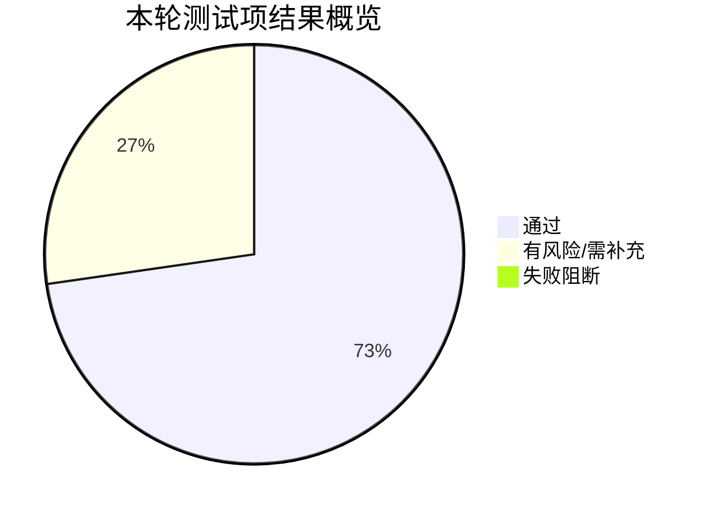
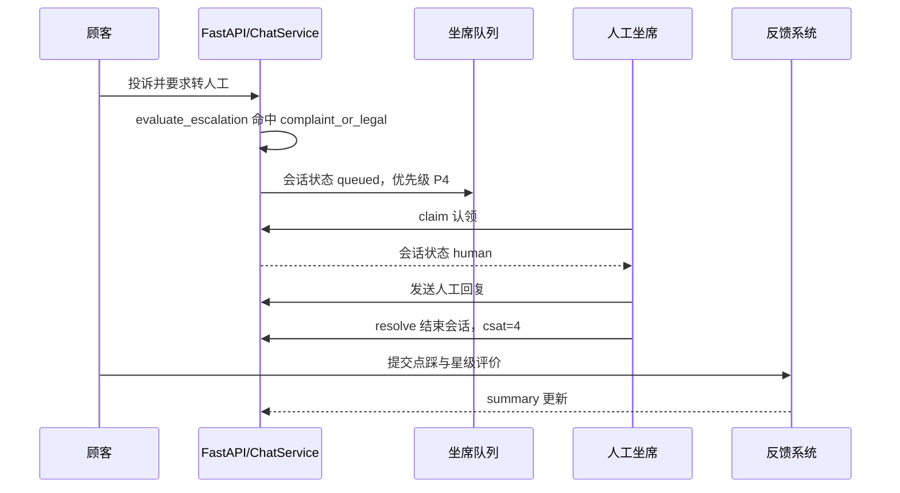

# 08-电商售后客服与用户评价分析系统-测试报告

> 项目组：25组-电商售后客服与用户评价分析系统
> 被测仓库：shopping-agent-with-PAHF-memory-system-by-Langgraph
> 被测提交：`9c3bda2`
> 测试时间：2026-06-29
> 测试结论：核心后端自动化测试通过；商城、转人工、坐席处理、评价分析 REST 主流程通过；真实大模型自动回复与浏览器 WebSocket 端到端流程需在配置有效 API_KEY 后补充验证。

## 1. 测试摘要

| 项目 | 结果 |
| --- | --- |
| pytest 自动化测试 | 33 passed，1 warning |
| 后端启动 | 通过 |
| 健康检查 | 通过 |
| 商城分类/搜索/详情接口 | 通过 |
| 投诉转人工流程 | 通过 |
| 坐席认领/回复/结束流程 | 通过 |
| 用户评价写入与汇总 | 通过 |
| 前端构建 | 通过 |
| 环境检查脚本 | 33/35 通过，存在配置文件缺失提示 |
| 真实 LLM 自动回复 | 未完整验证，原因是本轮仅使用临时测试 API_KEY |



图 1 本轮测试结果概览。

## 2. 测试环境

| 项目 | 实际值 |
| --- | --- |
| 工作目录 | `C:\Users\tangzhice\Desktop\SBU_remote_intern\shopping-agent-with-PAHF-memory-system-by-Langgraph` |
| 操作系统 | Windows |
| Python | 3.11.5 |
| Node.js | v24.11.0 |
| npm | 11.6.1 |
| 后端端口 | `127.0.0.1:8000` |
| 数据库 | SQLite，本地数据目录 `data/` |
| 测试工具 | pytest、curl.exe、PowerShell Invoke-RestMethod、npm |

## 3. 执行过程

### 3.1 依赖安装

首次执行 pytest 时，当前 Python 环境缺少 FastAPI，导入阶段失败：

```text
ModuleNotFoundError: No module named 'fastapi'
```

随后执行：

```powershell
python -m pip install -r requirements.txt
```

依赖安装成功。安装过程中 pip 提示当前 base 环境中存在若干第三方包版本冲突，例如 `anaconda-cloud-auth` 依赖 pydantic 1.x，而项目需要 pydantic 2.9.2。该提示未影响本项目 pytest 与后端启动，但建议正式测试使用独立 conda/venv 环境。

### 3.2 自动化测试

执行命令：

```powershell
python -m pytest -q
```

执行结果：

```text
collected 33 items

tests\test_api.py ....                                                   [ 12%]
tests\test_config.py ....                                                [ 24%]
tests\test_graph.py .                                                    [ 27%]
tests\test_pahf_memory_api.py .                                          [ 30%]
tests\test_prompt_factory.py .......                                     [ 51%]
tests\test_session_store.py ......                                       [ 69%]
tests\test_tool_planner_executor.py .                                    [ 72%]
tests\test_tool_registry.py .                                            [ 75%]
tests\test_tools_builtin.py ..                                           [ 81%]
tests\test_universal_chat.py ......                                      [100%]

33 passed, 1 warning in 45.58s
```

自动化测试覆盖内容：

| 测试文件 | 覆盖能力 | 结果 |
| --- | --- | --- |
| `test_api.py` | 健康检查、聊天 API、参数校验、SSE 流式接口 | 通过 |
| `test_config.py` | 模型配置、应用配置默认值 | 通过 |
| `test_graph.py` | LangGraph + PAHF 记忆闭环，新增/检索/更新记忆 | 通过 |
| `test_pahf_memory_api.py` | 记忆 CRUD、搜索、相似记忆 | 通过 |
| `test_prompt_factory.py` | prompt 加载、缓存、异常场景 | 通过 |
| `test_session_store.py` | 会话创建、查询、删除、TTL 过期清理 | 通过 |
| `test_tool_planner_executor.py` | 工具规划到执行的轻量集成 | 通过 |
| `test_tool_registry.py` | 工具注册与输入输出 schema 校验 | 通过 |
| `test_tools_builtin.py` | FAQ 检索、工单创建/查询/列表 | 通过 |
| `test_universal_chat.py` | OpenAI 兼容模型封装、历史记录、token 估算 | 通过 |

## 4. 后端启动验证

启动命令：

```powershell
$env:API_KEY='<your-api-key>'
$env:LOG_FORMAT='text'
$env:HOST='127.0.0.1'
$env:PORT='8000'
python -m uvicorn backend.main:app --host 127.0.0.1 --port 8000 --log-level info
```

关键启动日志：

```text
Started server process
Waiting for application startup.
Starting application...
Initialized model client: qwen-plus
Initialized session store
Initialized PAHF memory service
Initialized tool subsystem
Initialized chat graph
Initialized realtime + HITL subsystem
Application startup complete.
Uvicorn running on http://127.0.0.1:8000
```

结论：后端可以正常启动，模型客户端、PAHF 记忆、工具子系统、LangGraph、实时/HITL 子系统均完成初始化。

## 5. REST 接口验证结果

### 5.1 基础接口

| 接口 | 操作 | 实际结果 | 结论 |
| --- | --- | --- | --- |
| `/health` | GET | `{"status":"ok","model_name":"qwen-plus","active_sessions":0}` | 通过 |
| `/api/v1/models` | GET | 返回 OpenAI 兼容 `object=list` 与模型 `qwen-plus` | 通过 |

### 5.2 商城浏览接口

| 接口 | 操作 | 实际结果 | 结论 |
| --- | --- | --- | --- |
| `/api/v1/shop/categories` | GET | 返回数码3C、家居日用、服饰鞋包、美妆个护、母婴宠物、食品饮料、运动户外、图书文具等分类 | 通过 |
| `/api/v1/shop/products?query=耳机&limit=3` | GET | 返回 `P1002` 声波 X 主动降噪耳机 | 通过 |
| `/api/v1/shop/products/P1002` | GET | 返回价格 899 元、评分 4.6、两个 SKU：`P1002-BLK`、`P1002-WHT` | 通过 |

商品详情验证摘录：

```json
{
  "product_id": "P1002",
  "title": "声波 X 主动降噪耳机",
  "category": "数码3C",
  "price": 899.0,
  "rating": 4.6,
  "variants": [
    {"sku_code": "P1002-BLK", "stock": 12, "in_stock": true},
    {"sku_code": "P1002-WHT", "stock": 58, "in_stock": true}
  ]
}
```

### 5.3 售后转人工与坐席流程

本轮使用显式投诉/转人工消息验证升级路由。该路径在 LLM 调用前执行 pre-check，因此不依赖真实模型密钥。



图 2 本轮实测的售后转人工主流程。

| 步骤 | 接口 | 实际结果 | 结论 |
| --- | --- | --- | --- |
| 1 | POST `/api/v1/shop/chat` | 返回 `status=queued`，`reason=complaint_or_legal`，`priority=4` | 通过 |
| 2 | GET `/api/v1/agent/conversations?status=queued` | 返回会话 `CA66E9BA77F59`，状态 queued | 通过 |
| 3 | POST `/api/v1/agent/conversations/CA66E9BA77F59/claim` | 状态变为 `human`，`assigned_agent=agent-doc` | 通过 |
| 4 | POST `/api/v1/agent/conversations/CA66E9BA77F59/message` | 新增 `role=agent` 的人工消息，消息 ID 为 5 | 通过 |
| 5 | POST `/api/v1/agent/conversations/CA66E9BA77F59/resolve` | 状态变为 `resolved`，`csat=4` | 通过 |
| 6 | GET `/api/v1/agent/stats` | 返回 `resolved=1`，坐席 `agent-doc` inactive | 通过 |

坐席认领返回摘录：

```json
{
  "conversation_id": "CA66E9BA77F59",
  "customer_id": "c9001",
  "status": "human",
  "assigned_agent": "agent-doc",
  "priority": 4,
  "escalation_reason": "complaint_or_legal"
}
```

结束会话返回摘录：

```json
{
  "conversation_id": "CA66E9BA77F59",
  "status": "resolved",
  "assigned_agent": "agent-doc",
  "csat": 4
}
```

### 5.4 用户评价与分析接口

| 接口 | 操作 | 实际结果 | 结论 |
| --- | --- | --- | --- |
| `/api/v1/feedback/tags` | GET | 返回 7 个低分原因标签 | 通过 |
| `/api/v1/feedback/message` | POST，message_id=3，value=down | 返回 `value=down` | 通过 |
| `/api/v1/feedback/rating` | POST，stars=4 | 返回 `stars=4`，comment 写入 | 通过 |
| `/api/v1/feedback/summary` | GET | 评价数 1，平均星级 4.0，down=1 | 通过 |
| `/api/v1/feedback/ratings?limit=5` | GET | 返回刚写入的评分记录 | 通过 |

评价汇总返回摘录：

```json
{
  "ratings": {
    "count": 1,
    "avg_stars": 4.0,
    "distribution": {"1":0,"2":0,"3":0,"4":1,"5":0}
  },
  "messages": {
    "up": 0,
    "down": 1,
    "total": 1,
    "satisfaction": 0.0
  },
  "top_tags": []
}
```

结论：用户评价系统能够完成“逐条反馈 + 会话星级 + 后台汇总”的闭环。

## 6. 前端构建验证

执行命令：

```powershell
cd frontend
npm install
npm run build
```

安装结果：

```text
added 114 packages, and audited 115 packages
4 vulnerabilities (1 low, 2 moderate, 1 high)
```

构建结果：

```text
> servicebot-frontend@0.1.0 build
> tsc -b && vite build

vite v5.4.21 building for production...
36 modules transformed.
dist/index.html
dist/assets/index-BC4hKtFP.css
dist/assets/index-CwjTucxc.js
built in 476ms
```

结论：前端 TypeScript 编译与 Vite 打包通过。npm audit 提示存在 4 个依赖漏洞，未在本轮展开审计明细，建议后续执行 `npm audit` 并评估是否升级。

## 7. 环境检查脚本结果

首次直接运行：

```powershell
python verify_setup.py
```

在 Windows 默认 GBK 控制台下报错：

```text
UnicodeEncodeError: 'gbk' codec can't encode character '\u2713'
```

设置 UTF-8 后重跑：

```powershell
$env:PYTHONIOENCODING='utf-8'
python verify_setup.py
```

结果：

```text
Verification Results: 33/35 checks passed
```

失败/警告项：

| 项 | 结果 | 说明 |
| --- | --- | --- |
| `.env.example` | Missing | README 和脚本均提到配置模板，但仓库当前未提供该文件 |
| `.env` | Not found | 本地未配置真实模型密钥，属于部署前置项 |

结论：环境检查脚本本身存在 Windows 控制台编码兼容问题；项目配置文件模板缺失，需要补充。

## 8. 缺陷与风险

| 编号 | 严重级别 | 问题 | 影响 | 建议 |
| --- | --- | --- | --- | --- |
| BUG-001 | P1 | 仓库缺少 `.env.example` | 新用户按 README/verify_setup 操作会找不到配置模板 | 增加 `.env.example`，包含 MODEL_NAME、BASE_URL、API_KEY、数据库路径等 |
| BUG-002 | P2 | `verify_setup.py` 在 Windows GBK 控制台下输出 `✓` 导致编码错误 | 环境检查脚本可能无法运行到完整检查阶段 | 使用 ASCII 符号，或在脚本内设置 UTF-8 输出 |
| RISK-001 | P2 | 本轮未使用真实 LLM API_KEY 做普通 AI 回复质量验证 | 无法证明真实模型回复质量、延迟、失败处理完全符合预期 | 配置真实 API_KEY 后补充 20 条售后问答评测 |
| RISK-002 | P2 | npm audit 提示 4 个漏洞 | 前端依赖存在潜在安全风险 | 执行 `npm audit`，评估升级或修复 |
| RISK-003 | P3 | PowerShell 命令行发送中文 JSON 时出现过终端编码显示/存储异常 | 手工 CLI 测试中文内容可能不可靠 | 浏览器前端验证 UTF-8；CLI 使用 UTF-8 byte body 或 Postman |
| RISK-004 | P3 | SQLite + 进程内 EventBus 适合单机演示 | 多实例部署时会话事件不能跨进程同步 | 后续引入 Redis/MQ，并补充分布式测试 |
| RISK-005 | P3 | 首次查询客户 360 的 PAHF 记忆时触发 HuggingFace/DragonPlus 模型文件下载 | 离线环境或首次冷启动时，坐席上下文接口可能变慢 | 部署前预下载模型缓存，或在启动阶段显式 warm up |

## 9. 未完成测试项

| 测试项 | 未完成原因 | 补测建议 |
| --- | --- | --- |
| 真实模型普通自动回复 | 已支持通过环境变量配置真实 API_KEY | 跑售后问答集并记录真实模型输出质量 |
| 浏览器端 WebSocket 完整体验 | 本轮主要验证 REST 与前端构建 | 启动 `npm run dev`，手动验证聊天挂件和坐席实时刷新 |
| 客户端中文输入链路 | 命令行中文 JSON 存在编码干扰 | 使用浏览器或 Postman 验证中文消息存储 |
| 并发与长连接稳定性 | 时间限制，且当前项目定位单机轻量演示 | 使用 Locust/JMeter 和 WebSocket 压测脚本 |
| 安全鉴权 | 系统当前未实现登录与权限 | 后续设计用户/坐席/管理员鉴权后再测 |

## 10. 测试结论

本轮测试结论为：有条件通过。

通过依据：

1. 仓库现有自动化测试 33 个用例全部通过，覆盖 API、配置、会话、PAHF 记忆、工具系统和模型封装。
2. 后端服务可以正常启动，核心子系统初始化成功。
3. 商城分类、商品搜索、商品详情接口实测通过。
4. 售后投诉转人工、坐席认领、人工回复、结束会话、CSAT 写入的主流程实测通过。
5. 用户评价系统可以完成单条反馈、整体评分和聚合汇总。
6. 前端 TypeScript 编译和 Vite 打包通过。

限制说明：

1. 普通 AI 自动回复质量没有用真实模型密钥完整验证。
2. 浏览器 WebSocket 端到端体验尚需补测。
3. `.env.example` 缺失和 Windows 编码问题会影响首次部署体验。

建议验收口径：

| 维度 | 结论 |
| --- | --- |
| 课程/阶段性项目演示 | 可以验收，建议演示商城、转人工、坐席工作台和评价汇总 |
| 作为真实线上系统 | 暂不建议直接上线，需要补鉴权、压测、真实模型评测和依赖安全审计 |
| 后续优先修复 | `.env.example`、verify_setup 编码、前端漏洞审计、真实 LLM 评测集 |
